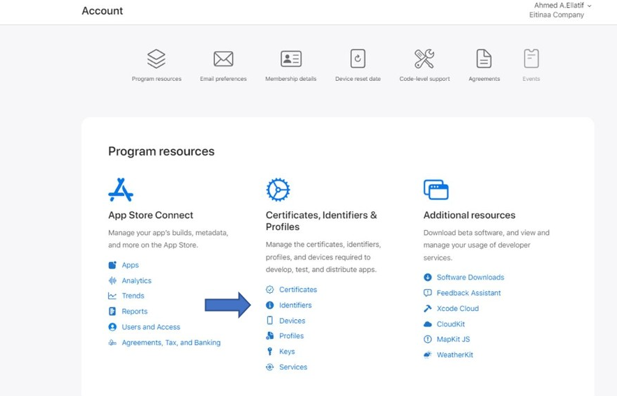
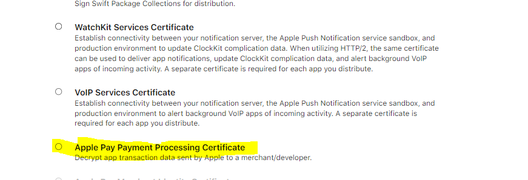
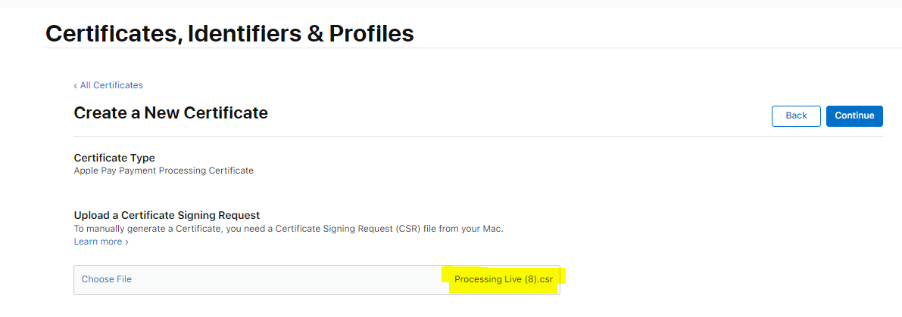
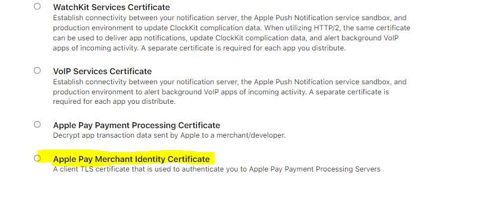
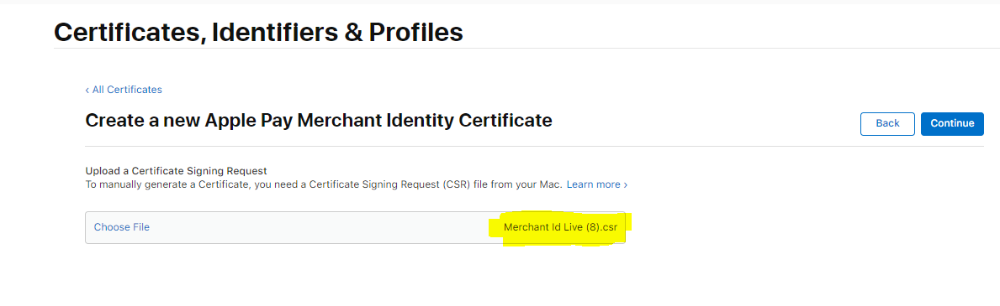
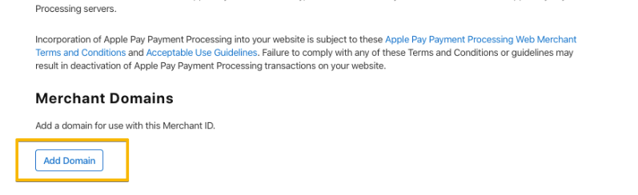
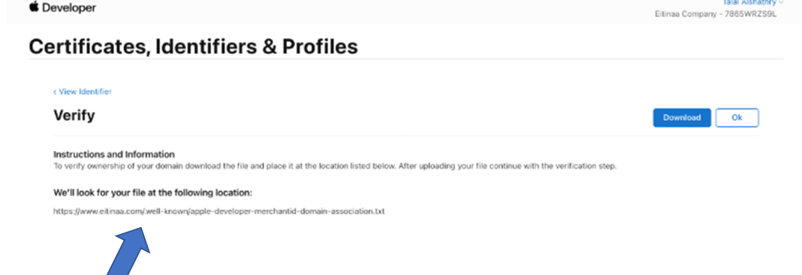
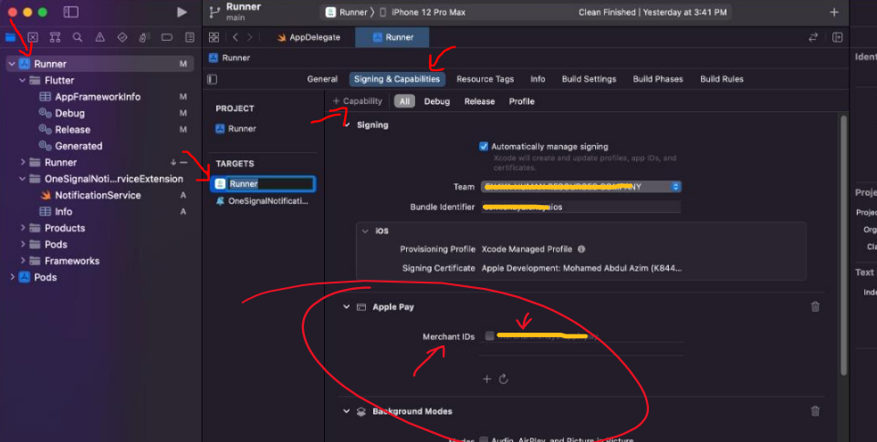

# Apple Pay Merchant ID Configuration Guide

This guide walks through setting up Apple Pay for use with the HyperPay SDK.

## Overview

There are 4 steps to configure Apple Pay:

1. Create Merchant ID identifier
2. Create Apple Payment Processing Certificate
3. Create Merchant Certificate
4. Verify website domain (for web payments)

Plus iOS project setup in Xcode.

---

## 1. Create Merchant ID Identifier

- Go to [developer.apple.com](https://developer.apple.com)
- Log in using your Apple ID
- Click **Account** > **Certificates, IDs & Profiles**



- In **Certificates, Identifiers & Profiles**, click **Identifiers** in the sidebar
- Click the add button **(+)** on the top left
- Create a **Merchant IDs** identifier for your business


- Select **Merchant IDs**, press **Continue**
- Enter a description and identifier (e.g. `merchant.com.your.app`), press **Continue** then **Register**

---

## 2. Create Apple Payment Processing Certificate

After registering the Merchant ID identifier, create a payment processing certificate to encrypt payment information.



- Select your **Merchant ID**
- Select **No** and continue
- Select the processing file from your computer



- Apple Pay payment processing certificate is created
- **Download** the certificate

---

## 3. Create Merchant Certificate

Create an Apple Pay merchant identity certificate.

- Select your **Merchant ID**



- Add the merchant file from your computer
- Select **Continue**, then **Download** the certificate



---

## 4. Verify Domain (for Web Payments)

- Add your website URL domain (e.g. `www.example.com`)



- Click **Download** to download the verification text file
- Upload this file to a `/.well-known/` folder in the HTTP root of your server
- Once it is in place, click the **Verify** button to confirm



---

## 5. iOS Project Setup in Xcode

- Open your Xcode project (**Runner**)
- Go to **Signing & Capabilities**
- Click **(+) Capability**
- Select **Apple Pay**
- Check your **Merchant ID**



---

## Using Apple Pay with HyperPay SDK

Once configured, use the `merchantId` in your Flutter code:

```dart
final result = await HyperpaySdk.payApplePay(
  checkoutId: checkoutId,
  merchantId: 'merchant.com.your.app', // the ID you registered above
  countryCode: 'SA',
  currencyCode: 'SAR',
  amount: 100.0,
  companyName: 'Your Company',
);
```

Or pass it via `ApplePayConfig` in ReadyUI:

```dart
final result = await HyperpaySdk.checkoutReadyUI(
  checkoutId: checkoutId,
  brands: ['VISA', 'MASTER', 'MADA'],
  shopperResultUrl: 'com.your.app.payments',
  applePayConfig: ApplePayConfig(
    merchantId: 'merchant.com.your.app',
    countryCode: 'SA',
    currencyCode: 'SAR',
    amount: 100.0,
    companyName: 'Your Company',
  ),
);
```

---

_Based on the guide by [Ahmad Elkhyary](https://github.com/ahmedelkhyary/applepay_merchantId_config)._
